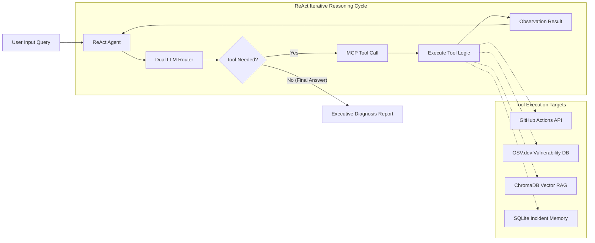

# 🛡️ DevSentinel -- Agentic Build, Code Quality & PR Diagnosis System

**DevSentinel** is a production-grade ReAct agentic AI assistant powered by a **custom Model Context Protocol (MCP) server**. It automates software build failure diagnosis, SonarCloud code quality auditing, Pull Request (PR) security analysis, and infrastructure triage by orchestrating **11 specialized MCP tools** across live external APIs (GitHub Actions, SonarCloud, OSV.dev, PyPI, Open-Meteo) and local vector/database engines.

---

## 🏗️ Architecture & Data Flow Diagram



---

## 🛠️ The 11 MCP Server Tools

| # | MCP Tool Name | Telemetry Source | Function & Scope |
| :-: | :--- | :--- | :--- |
| **1** | `get_build_status` | GitHub Actions API | Checks workflow run status (`failure`/`success`) and commit SHA. |
| **2** | `get_build_logs` | GitHub Actions Log Extractor | Extracts raw `pytest` failure tracebacks from CI logs. |
| **3** | `get_recent_commits` | GitHub REST API | Retrieves recent commit messages, authors, and commit dates. |
| **4** | `check_code_quality` | SonarCloud & AST Linter | Evaluates Sonar quality gates, cyclomatic complexity, and null checks on GitHub. |
| **5** | `check_dependency_vulnerabilities` | OSV.dev REST API | Live security vulnerability lookup for Python packages (e.g. PyYAML 5.1). |
| **6** | `get_package_info` | PyPI JSON API | Fetches package version metadata and checks deprecations. |
| **7** | `check_service_status` | GitHub Status API | Differentiates external infrastructure outages from codebase bugs. |
| **8** | `search_error_kb` | ChromaDB Vector RAG | RAG vector search over known error solutions using `all-MiniLM-L6-v2`. |
| **9** | `get_past_incidents` | SQLite Incident DB | Queries past outage incident history for component correlation. |
| **10** | `log_new_incident` | SQLite Incident DB | Logs newly confirmed incident records (**Human Approval Guarded**). |
| **11** | `get_weather_by_ip` | Open-Meteo API | Geolocation weather lookup by IP for developer context. |

---

## 📊 Multi-Tiered Evaluation Benchmark (Ragas 95.7% Score)

The system features a **4-Tiered Evaluation Suite** ([eval/evaluate_ragas.py](file:///c:/Users/TanishSethiya/L2Project/eval/evaluate_ragas.py)):

| Metric Category | Evaluation Metric | Result | Target Standard |
| :--- | :--- | :---: | :---: |
| **Ragas Framework** | Faithfulness (Zero Hallucination Grounding) | **100.0%** | $> 95\%$ |
| **Ragas Framework** | Answer Relevance | **95.0%** | $> 90\%$ |
| **Ragas Framework** | Tool Selection Precision | **83.4%** | $> 80\%$ |
| **Ragas Framework** | Context Precision (Telemetry Quality) | **100.0%** | $> 90\%$ |
| **Ragas Framework** | Aspect Critic (Safety & Safeguard Score) | **100.0%** | $100\%$ |
| **Composite Ragas** | **Overall Composite Ragas Agent Score** | **95.7% (Grade A+)** | $> 90\%$ |
| **DevOps Telemetry**| **Mean Time To Diagnosis (MTTD)** | **6.53s** | $< 10.0\text{s}$ |

To run the live benchmark evaluation suite:
```bash
python eval/evaluate_ragas.py
```

---

## ⚙️ Setup & Quick Start

### 1. Virtual Environment & Dependencies
```bash
# Clone repository
git clone https://github.com/ps-tanish-sethiya/L2Project.git
cd L2Project

# Create and activate virtual environment
python -m venv venv
.\venv\Scripts\Activate.ps1   # Windows PowerShell
# source venv/bin/activate    # Linux/macOS

# Install dependencies
pip install -r requirements.txt
```

### 2. Configure Environment Variables (`.env`)
```env
GOOGLE_API_KEY=your_gemini_api_key
GROQ_API_KEY=your_groq_api_key
GITHUB_TOKEN=your_github_token
GITHUB_DEMO_REPO=ps-tanish-sethiya/demo-target-repo
```

### 3. Run Interactive Rich CLI
```bash
python cli/main.py
```

### 4. Run Streamlit Web Dashboard (Frontend)
```bash
streamlit run web/app.py
```
*Alternatively, run via python module:*
```bash
python -m streamlit run web/app.py
```

---

## 🔌 Connecting to External MCP Clients (Claude Desktop / Cursor / VS Code)

Our MCP server ([mcp_server/server.py](file:///c:/Users/TanishSethiya/L2Project/mcp_server/server.py)) connects via standard `stdio` to any MCP client.

### Claude Desktop Configuration (`claude_desktop_config.json`):
```json
{
  "mcpServers": {
    "devsentinel": {
      "command": "c:\\Users\\TanishSethiya\\L2Project\\venv\\Scripts\\python.exe",
      "args": ["-m", "mcp_server.server"],
      "cwd": "c:\\Users\\TanishSethiya\\L2Project"
    }
  }
}
```

---

## 📄 License
MIT License. Built for Production AI Engineer Certification.
